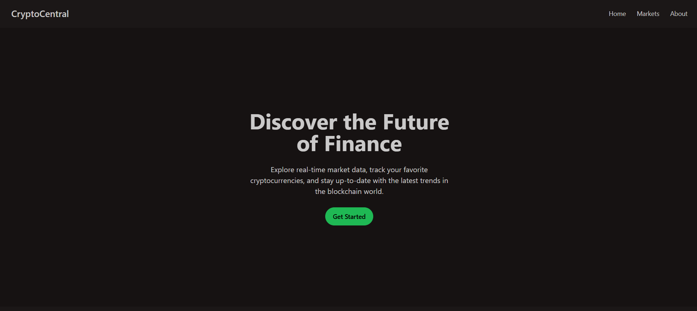
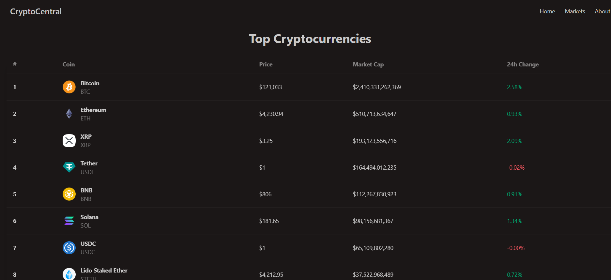

### Coin Gecko App

A modern cryptocurrency tracker built with React.js, featuring real-time market data, dynamic tables, and detailed coin information.

#### Features
- **Real-time Market Data:** View the top cryptocurrencies in a responsive, paginated table.
- **Detailed Coin Views:** Click on any cryptocurrency to see in-depth details, including market cap, 24-hour high/low, and a description.
- **Loading Skeletons:** A smooth user experience is provided with custom skeleton loaders for both the main table and the detail pages while data is being fetched.
- **Responsive UI:** The application is styled with Tailwind CSS and DaisyUI, ensuring a consistent and clean look across all devices.

#### Screenshots




 

#### Tech Stack
- **Frontend Framework:** React
- **Data Fetching:** `@tanstack/react-query`
- **Routing:** `react-router`
- **Styling:** `tailwindcss`, `daisyui`
- **Build Tool:** `vite`

#### Installation
1.  Clone the repository:
    ```bash
    git clone [your-repo-url]
    cd coin-gecko
    ```
2.  Install dependencies:
    ```bash
    npm install
    ```
3.  Start the development server:
    ```bash
    npm run dev
    ```
4.  Open your browser to `http://localhost:5173` to view the application.